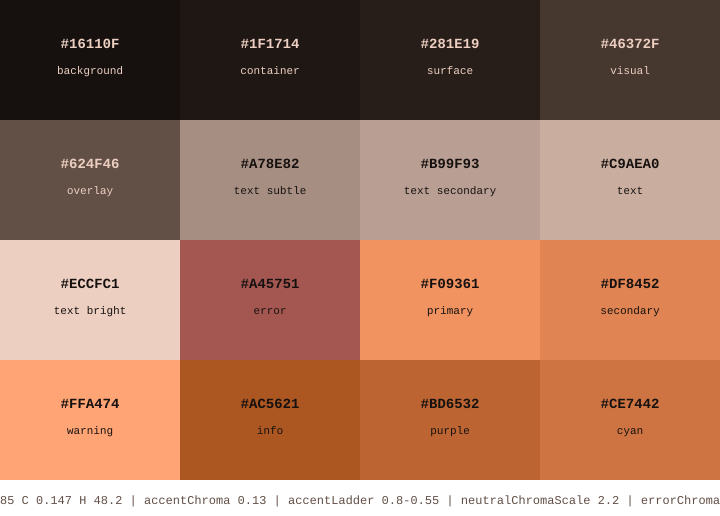

# Cinder Muted

Muted monochrome variant of my [Cinder Grove](https://github.com/aileks/cinder-grove.nvim) theme.



## Ports

- [bat](bat/README.md)
- [btop](btop/README.md)
- [cava](cava/README.md)
- [Dark Reader](dark-reader/README.md)
- [dunst](dunst/README.md)
- [Emacs](emacs/README.md)
- [fzf](fzf/README.md)
- [GTK 3/4](gtk/README.md)
- [i3lock-color](i3lock-color/README.md)
- [Neovim](https://github.com/aileks/cinder-muted.nvim)
- [qt6ct](qt6ct/README.md)
- [rofi](rofi/README.md)
- [st](st/README.md)
- [Xresources](xresources/README.md)
- [yazi](yazi/README.md)

## Development

```sh
pnpm install
pnpm build   # render every generated file
pnpm check   # fail if committed outputs are out of sync
pnpm test
```

The palette derives from the Cinder Grove colors in `src/palette.ts`. `templates/` holds one upstream config per port; when a port changes, copy the new file in and re-render. The Neovim palette renders into the `nvim/` submodule, so commit inside the submodule first, then the new pointer here.

## License

GPL-3.0-or-later. The GTK theme's vendored adw-gtk3 base is LGPL-2.1. See `gtk/LICENSE` and `gtk/Cinder-Muted-Dark/COPYING.adw-gtk3`.
